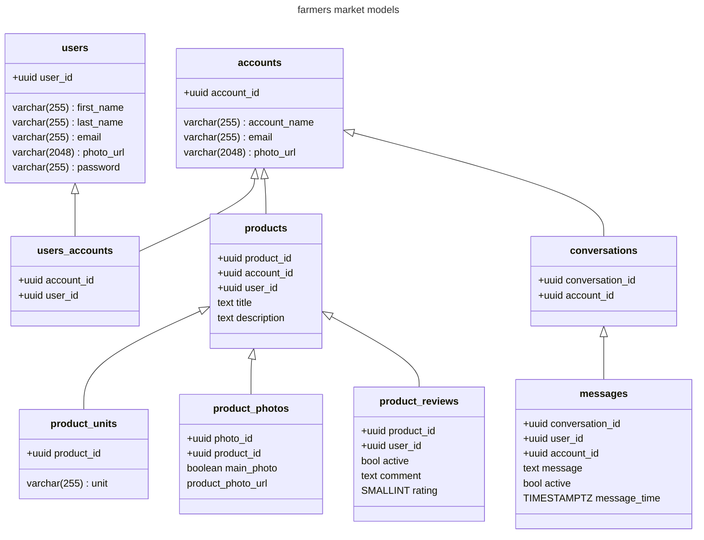

```mermaid
---
title: farmers market models
---
classDiagram
    users <|-- users_accounts
    accounts <|-- users_accounts
    accounts <|-- products
    products <|-- product_units
    products <|-- product_photos
    products <|-- product_reviews 
    accounts <|-- conversations
    conversations <|-- messages
    class users
    users : +uuid user_id
    users : varchar(255) first_name
    users : varchar(255) last_name
    users : varchar(255) email
    users : varchar(2048) photo_url
    users : varchar(255) password
    class accounts
    accounts : +uuid account_id
    accounts : varchar(255) account_name
    accounts : varchar(255) email
    accounts : varchar(2048) photo_url
    class users_accounts
    users_accounts : +uuid account_id
    users_accounts : +uuid user_id
    class products
    products : +uuid product_id
    products : +uuid account_id
    products : +uuid user_id
    products : text title
    products : text description
    class product_units
    product_units : +uuid product_id
    product_units : varchar(255) unit
    class product_photos
    product_photos : +uuid photo_id
    product_photos : +uuid product_id
    product_photos : boolean main_photo
    product_photos : product_photo_url
    class product_reviews
    product_reviews : +uuid product_id
    product_reviews : +uuid user_id
    product_reviews : bool active
    product_reviews : text comment
    product_reviews : SMALLINT rating
    class messages
    messages : +uuid conversation_id
    messages : +uuid user_id  
    messages : +uuid account_id  
    messages : text message
    messages : bool active
    messages : TIMESTAMPTZ message_time
    class conversations
    conversations : +uuid conversation_id
    conversations : +uuid account_id


```